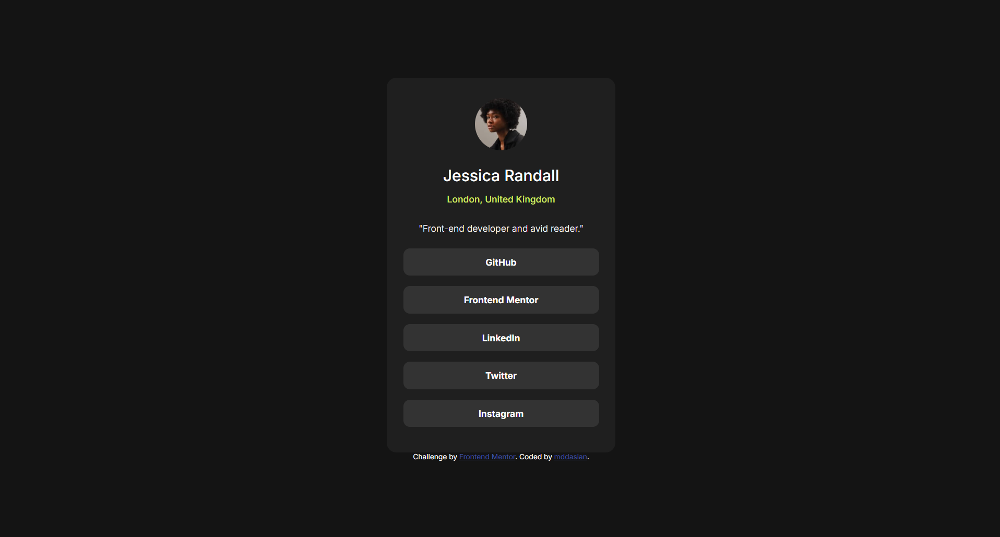
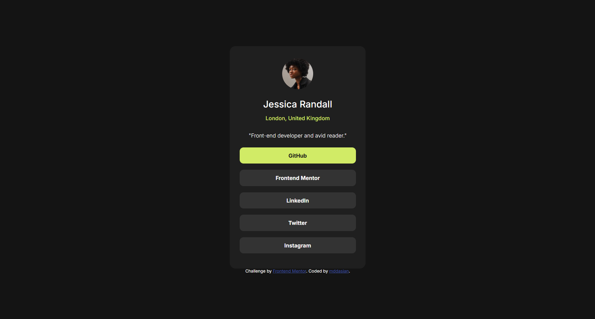

# Frontend Mentor - Social links profile solution

This is a solution to the [Social links profile challenge on Frontend Mentor](https://www.frontendmentor.io/challenges/social-links-profile-UG32l9m6dQ). Frontend Mentor challenges help you improve your coding skills by building realistic projects. 

## Table of contents

- [Overview](#overview)
  - [The challenge](#the-challenge)
  - [Screenshot](#screenshot)
- [My process](#my-process)
  - [Built with](#built-with)
  - [What I learned](#what-i-learned)

**Note: Delete this note and update the table of contents based on what sections you keep.**

## Overview

### The challenge

Users should be able to:

- See hover and focus states for all interactive elements on the page

### Screenshot




## My process

### Built with

- Semantic HTML5 markup
- CSS custom properties
- Flexbox

### What I learned

I found it especially challenging to build the design without the Figma file. However, I feel that I did a good job doing so. In order to figure out the colors in the design, I imported the design pictures into Microsoft Paint and color picked the colors. It was also difficult deciding what the font's weight and sizing was. I learned how to build the card without using the Figma file.

```html
<h1>Some HTML code I'm proud of</h1>
```
```css
button {
    font-family: "Inter", sans-serif;
    color: rgb(255, 255, 255);
    background-color: rgb(51, 51, 51);
    border-style: none;
    border-radius: 10px;
    font-weight: 700;
    font-size: 14px;
    margin: 8px 0;
    height: 42px;
    width: 300px;
}

button:hover {
    background-color: rgb(209, 235, 102);
    color: rgb(20, 20, 20);
}
```